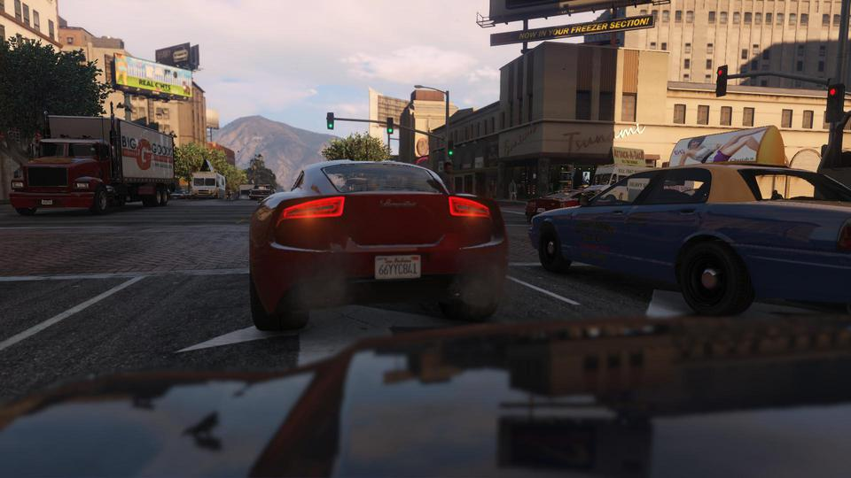
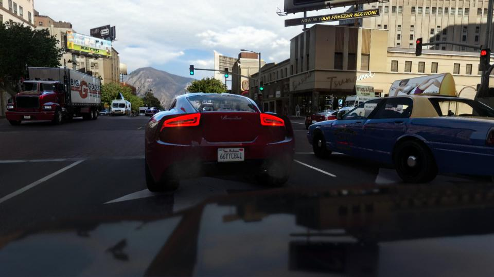
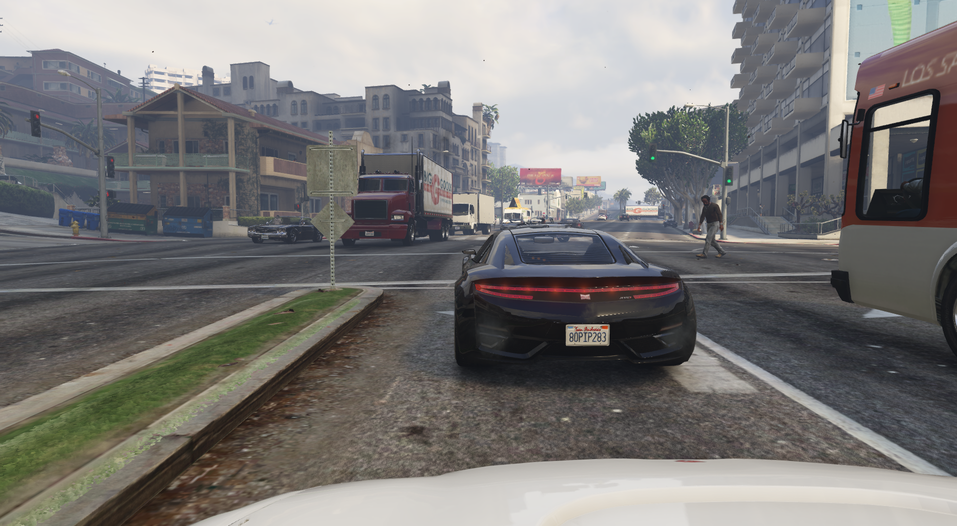
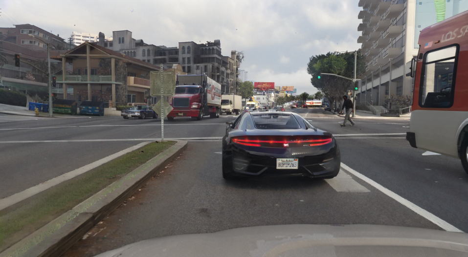
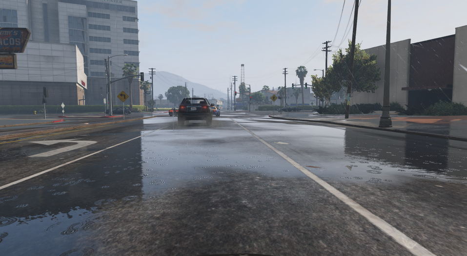
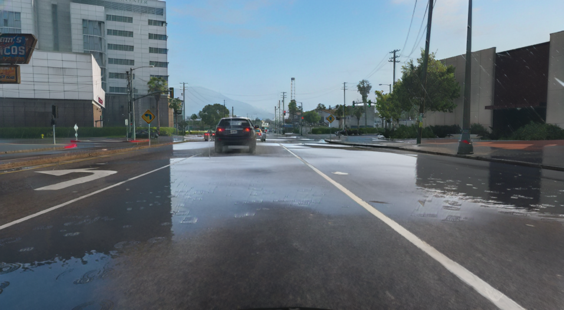
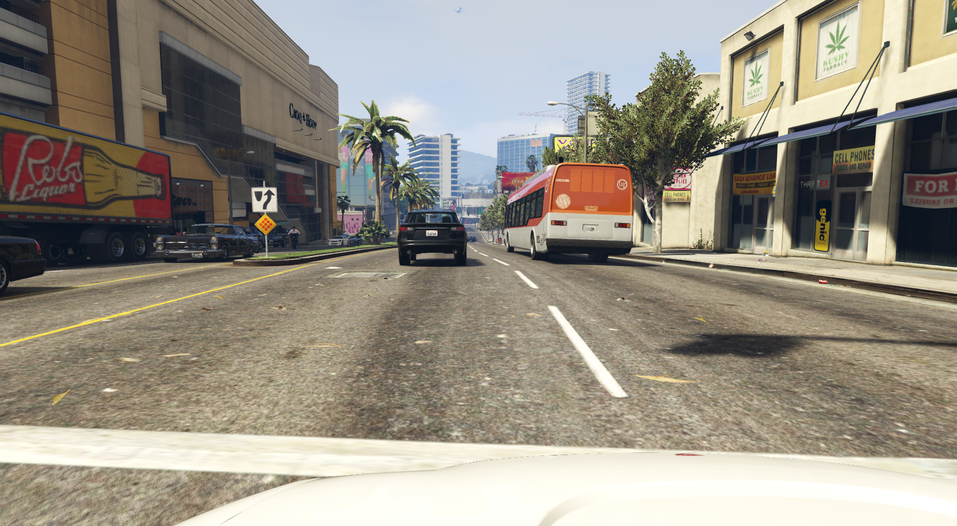
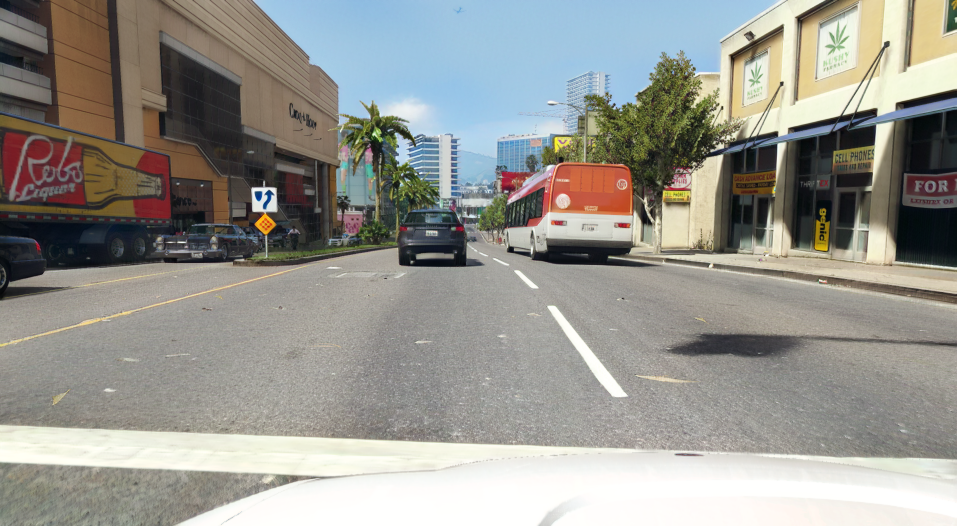

# RealFormer - Photorealism over Supersampling

EmelinLabs introduces RealFormer, a novel Image-to-Image Transformer-based architecture designed and trained to enhance photorealism in images, particularly focused on bringing a real lifelike style to synthetic artifacts in media.


## Model Details

Detailed description of model, its architecture, training data and procedures.

### Model Description

RealFormer is an innovative Vision Transformer (ViT) based architecture that combines elements of Linear Attention (approximation attention) with Swin Transformers and adaptive instance normalization (AdaIN) for style transfer. It's designed to transform images,specifically targeted at the video game and animation industry, potentially enhancing their photorealism or applying style transfer.

- **Developed by:** Alosh Denny
- **Funded by:** EmelinLabs
- **Shared by:** EmelinLabs
- **Model type:** Image-to-Image Transformer
- **Language(s) (NLP):** None (Pre-trained Generative Image Model)
- **License:** Apache-2.0
- **Finetuned from model [optional]:** Novel; Pre-trained (not finetuned)

### Model Sources [optional]

- **Dataset:** [Pre-Training Dataset](https://huggingface.co/datasets/aoxo/latent_diffusion_super_sampling), [Calibration Dataset for Grand Theft Auto V](https://huggingface.co/datasets/aoxo/photorealism-style-adapter-gta-v)
- **Repository:** [Swin Transformer](https://github.com/microsoft/Swin-Transformer)
- **Paper:** [Ze Liu et al. (2021)](https://arxiv.org/abs/2103.14030)

## Uses

### Direct Use

RealFormer is designed for image-to-image translation tasks. It can be used directly for:

- Enhancing photorealism in synthetic images (e.g., transforming video game graphics to more realistic images)
- Style transfer between rendered frames and post-processed frames
- To be incorporated in pipeline with [DLSS](https://developer.nvidia.com/rtx/dlss)

### Downstream Use

Potential downstream uses could include:

- Integration into game engines for real-time graphics enhancement - AdaIN layers are finetunable for video-game-specific usecases. In this implementation, the models have been pretrained on a variety of video for **super-sampling**, **photorealistic style transfer** and **reverse photorealism**.
- Pre-processing step in computer vision pipelines to improve input image quality - Decoder layers can be frozen for task-specific usecases.
- Photo editing software for synthesized image enhancement

### Out-of-Scope Use

This model is not recommended for:

- Generating or manipulating images in ways that could be deceptive or harmful
- Tasks requiring perfect preservation of specific image details, as the transformation process may alter some artifacts of the image
- Medical or forensic image analysis where any alteration could lead to misinterpretation. Remember, this is a  model, not a classification or detection model.

## Bias, Risks, and Limitations

- The model may introduce biases present in the training data, potentially altering images in ways that reflect these biases.
- There's a risk of over-smoothing or losing fine details in the image transformation process.
- The model's performance may vary significantly depending on the input image characteristics and how similar they are to the training data.
- As with any image manipulation tool, there's a potential for misuse in creating deceptive or altered images.

## How to Get Started with the Model

Use the code below to get started with the model.

```python
# Instantiate the model
model = ViTImage2Image(img_size=512, patch_size=16, emb_dim=768, num_heads=16, num_layers=8, hidden_dim=3072)

# Move model to GPU if available
device = torch.device("cuda" if torch.cuda.is_available() else "cpu")
model = model.to(device)

# Load an image
input_image = load_image('path_to_your_image.png')
input_image = input_image.to(device)

# Perform inference
with torch.no_grad():
    output = model(input_image, input_image)  # Using input as both content and style for this example

# Visualize or save the output
visualize_tensor(output, "Output Image")
```

## Training Details

### Training Data

The model was trained on [Pre-Training Dataset](https://huggingface.co/datasets/aoxo/latent_diffusion_super_sampling) and then the decoder layers were frozen to finetune it on the [Calibration Dataset for Grand Theft Auto V](https://huggingface.co/datasets/aoxo/photorealism-style-adapter-gta-v). The former includes over 400,000 frames of footage from video games such as WatchDogs 2, Grand Theft Auto V, CyberPunk, several Hollywood films and high-defintion photos. The latter comprises of ~25,000 high-definition semantic segmentation map - rendered frame pairs captured from Grand Theft Auto V in-game and a UNet based Semantic Segmentation Model.

### Training Procedure

- Optimizer: Adam
- Learning rate: 0.001
- Batch size: 8
- Steps per epoch: 3,125
- Number of epochs: 100
- Total number of steps: 312,500
- Loss function: Combined L1 loss, Perpetual Loss, Style Transfer Loss, Total Variation loss

#### Preprocessing

Images and their corresponding style semantic maps were resized to fit the input-output window dimensions (512 x 512). Bit depth has been recorrected to 24bit (3 channel) for images with depth greater than 24bit.

#### Training Hyperparameters

- Precision:fp32
- Embedded dimensions: 768
- Hidden dimensions: 3072
- Attention Type: Linear Attention
- Number of attention heads: 16
- Number of attention layers: 8
- Number of transformer encoder layers (feed-forward): 8
- Number of transformer decoder layers (feed-forward): 8
- Activation function(s): ReLU, GeLU
- Patch Size: 8
- Swin Window Size: 7
- Swin Shift Size: 2
- Style Transfer Module: AdaIN

#### Speeds, Sizes, Times

**Model size:** There are currently four versions of the model:
- v1_1: 224M params
- v1_2: 200M params
- v1_3: 93M params
- v2_1: 2.9M params

**Training hardware:** Each of the models were trained on 2 x T4 GPUs (multi-GPU training). For this reason, linear attention modules were implemented as ring (distributed) attention during training.

**Total Training Compute Throughput:** 4.13 TFLOPS

**Total Logged Training Time:** ~210 hours (total time split across four models including overhead)

**Start Time:** 09-13-2024 

**End Time:** 09-21-2024

**Checkpoint Size:**
- v1_1: 855 MB
- v1_2: 764 MB
- v1_3: 355 MB
- v2_2: 11 MB

## Evaluation Data, Metrics & Results

This section covers information on how the model was evaluated at each stage.

### Evaluation Data

Evaluation was performed on real-time footage captured from Grand Theft Auto V, Cyberpunk 2077 and WatchDogs 2.

### Metrics

- PSNR (Peak Signal-to-Noise Ratio)
- Combined loss (L1 loss + Total Variation loss)

### Results

- In-game 

- Ours 

- In-game 

- Ours 

- In-game 

- Ours 

- In-game 

- Ours 

## Environmental Impact

<!-- Total emissions (in grams of CO2eq) and additional considerations, such as electricity usage, go here. Edit the suggested text below accordingly -->

Carbon emissions can be estimated using the [Machine Learning Impact calculator](https://mlco2.github.io/impact#compute) presented in [Lacoste et al. (2019)](https://arxiv.org/abs/1910.09700).

- **Hardware Type:** 2 x Nvidia T4 16GB GPUs 
- **Hours used:** 210 (per GPU); 420 (combined)
- **Cloud Provider:** Kaggle
- **Compute Region:** US
- **Carbon Emitted:** 8.82 kg CO2

## Technical Specifications

### Model Architecture and Objective

RealFormer is a Transformer-based low-latency Style Transfer Generative LM that attempts to reconstruct each frame into a more photorealistic image.
The objective of RealFormer is to attain the maximum level of detail to the real-world, which even current video games with exhaustive graphics are not able to. 

**Architecture:** The latest model, v2_1, introduces Location-based Multi-head Attention (LbMhA) to improve feature extraction at lower parameters. The three other predecessors attained a similar level of accuracy without the LbMhA layers. The general architecture is as follows:

```python
DataParallel(
  (module): ViTImage2Image(
    (patch_embed): Conv2d(3, 768, kernel_size=(16, 16), stride=(16, 16))
    (encoder_layers): ModuleList(
      (0-7): 8 x TransformerEncoderBlock(
        (attn): LocationBasedMultiheadAttention(
          (q_proj): Linear(in_features=768, out_features=768, bias=True)
          (k_proj): Linear(in_features=768, out_features=768, bias=True)
          (v_proj): Linear(in_features=768, out_features=768, bias=True)
          (out_proj): Linear(in_features=768, out_features=768, bias=True)
          (dropout): Dropout(p=0.1, inplace=False)
        )
        (ff): Sequential(
          (0): Linear(in_features=768, out_features=3072, bias=True)
          (1): ReLU()
          (2): Linear(in_features=3072, out_features=768, bias=True)
        )
        (norm1): LayerNorm((768,), eps=1e-05, elementwise_affine=True)
        (norm2): LayerNorm((768,), eps=1e-05, elementwise_affine=True)
        (adain): AdaIN(
          (norm): InstanceNorm1d(768, eps=1e-05, momentum=0.1, affine=False, track_running_stats=False)
          (fc): Linear(in_features=768, out_features=1536, bias=True)
        )
        (dropout): Dropout(p=0.1, inplace=False)
      )
    )
    (decoder_layers): ModuleList(
      (0-7): 8 x TransformerDecoderBlock(
        (attn1): LocationBasedMultiheadAttention(
          (q_proj): Linear(in_features=768, out_features=768, bias=True)
          (k_proj): Linear(in_features=768, out_features=768, bias=True)
          (v_proj): Linear(in_features=768, out_features=768, bias=True)
          (out_proj): Linear(in_features=768, out_features=768, bias=True)
          (dropout): Dropout(p=0.1, inplace=False)
        )
        (attn2): LocationBasedMultiheadAttention(
          (q_proj): Linear(in_features=768, out_features=768, bias=True)
          (k_proj): Linear(in_features=768, out_features=768, bias=True)
          (v_proj): Linear(in_features=768, out_features=768, bias=True)
          (out_proj): Linear(in_features=768, out_features=768, bias=True)
          (dropout): Dropout(p=0.1, inplace=False)
        )
        (ff): Sequential(
          (0): Linear(in_features=768, out_features=3072, bias=True)
          (1): ReLU()
          (2): Linear(in_features=3072, out_features=768, bias=True)
        )
        (norm1): LayerNorm((768,), eps=1e-05, elementwise_affine=True)
        (norm2): LayerNorm((768,), eps=1e-05, elementwise_affine=True)
        (norm3): LayerNorm((768,), eps=1e-05, elementwise_affine=True)
        (norm4): LayerNorm((768,), eps=1e-05, elementwise_affine=True)
        (adain1): AdaIN(
          (norm): InstanceNorm1d(768, eps=1e-05, momentum=0.1, affine=False, track_running_stats=False)
          (fc): Linear(in_features=768, out_features=1536, bias=True)
        )
        (adain2): AdaIN(
          (norm): InstanceNorm1d(768, eps=1e-05, momentum=0.1, affine=False, track_running_stats=False)
          (fc): Linear(in_features=768, out_features=1536, bias=True)
        )
        (dropout): Dropout(p=0.1, inplace=False)
      )
    )
    (swin_layers): ModuleList(
      (0-7): 8 x SwinTransformerBlock(
        (norm1): LayerNorm((768,), eps=1e-05, elementwise_affine=True)
        (attn): MultiheadAttention(
          (out_proj): NonDynamicallyQuantizableLinear(in_features=768, out_features=768, bias=True)
        )
        (mlp): Sequential(
          (0): Linear(in_features=768, out_features=3072, bias=True)
          (1): GELU(approximate='none')
          (2): Linear(in_features=3072, out_features=768, bias=True)
        )
        (norm2): LayerNorm((768,), eps=1e-05, elementwise_affine=True)
      )
    )
    (norm): LayerNorm((768,), eps=1e-05, elementwise_affine=True)
    (mlp_head): Sequential(
      (0): Linear(in_features=768, out_features=3072, bias=True)
      (1): GELU(approximate='none')
      (2): Linear(in_features=3072, out_features=768, bias=True)
    )
    (refinement): RefinementBlock(
      (conv): Conv2d(768, 3, kernel_size=(3, 3), stride=(1, 1), padding=(1, 1))
      (bn): BatchNorm2d(3, eps=1e-05, momentum=0.1, affine=True, track_running_stats=True)
      (relu): ReLU(inplace=True)
    )
    (style_encoder): Sequential(
      (0): Conv2d(3, 768, kernel_size=(3, 3), stride=(2, 2), padding=(1, 1))
      (1): ReLU()
      (2): AdaptiveAvgPool2d(output_size=1)
      (3): Flatten(start_dim=1, end_dim=-1)
      (4): Linear(in_features=768, out_features=768, bias=True)
    )
  )
)
```

### Compute Infrastructure

#### Hardware

2 x Nvidia T4 16GB GPUs

#### Software

- PyTorch
- torchvision
- einops
- numpy
- PIL (Python Imaging Library)
- matplotlib (for visualization)

## Model Card Authors

Alosh Denny

## Model Card Contact

aloshdenny@gmail.com